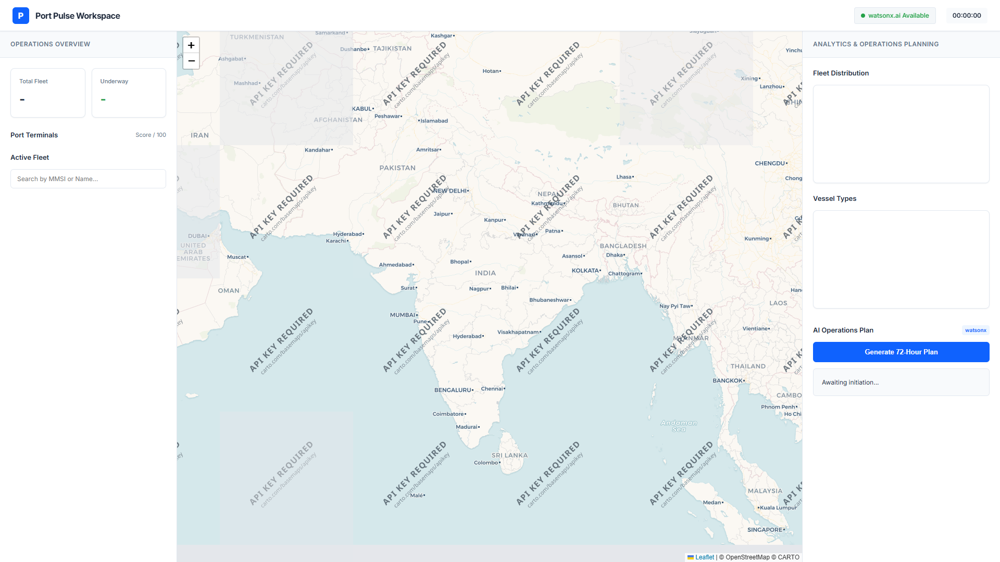

# 🚀 Port Pulse — AI-Powered Container Congestion Predictor & Port Operations Optimiser



---

## 👥 Team

| Field | Value |
|---|---|
| **Team Name** | Code Blooded |
| **Track** | AI |
| **Team Lead** | Shubham Vora — shubhamvora269@gmail.com |
| **Members** | Rudra Vaghasiya, Vraj Viradiya, Jay Zalavadiya |

---

## 🎯 Problem Statement

Port operators manage berth allocation, crane scheduling, and vessel routing using manual spreadsheets. Congestion hotspots are identified only after vessels are already queuing — costing global supply chains billions. The 2021 LA/Long Beach backlog saw 100+ ships waiting for weeks, costing $10B+. Operators need a real-time, AI-driven system that predicts congestion before it happens and generates actionable 72-hour operations plans.

---

## 💡 Solution

Port Pulse is an AI-powered web dashboard that ingests live global satellite tracking data via AISStream to predict congestion hotspots per terminal using a multi-factor scoring engine (0–100). It auto-assigns vessels to optimal berths, dynamically recommends alternate routing strategies (e.g. JNPT to Mundra diversions), and uses IBM watsonx.ai (Llama 3.3 70B) to generate a natural-language 72-hour port operations and crew pre-positioning plan. Built with IBM Bob as the core development partner.

---

## ✨ Key Features

- **Live Global Tracking:** Ingests 100% real-world maritime vessel positions streaming via global AIS satellites.
- **Multi-factor Congestion Scoring:** Normalised vessel density + queue pressure + dynamic load balancing per port terminal.
- **Automated Routing & Berth Assignment:** Best-fit algorithm for routing ships away from highly congested terminals (e.g., scoring > 60) to relieve supply chain bottlenecks. 
- **IBM watsonx.ai 72-Hour Operations Plan:** Llama 3.3 70b Instruct model generates a highly structured tactical brief complete with a Visual Executive Summary.
- **Professional B2B SaaS UI:** Fully responsive, enterprise-grade React-style dashboard (built natively in CSS/JS) featuring direct Click-to-Fly map logic.

---

## 🛠️ Tech Stack

| Category | Technologies |
|---|---|
| **Languages** | Python 3.11, HTML5, CSS3, JavaScript |
| **Frameworks** | FastAPI, Uvicorn, Chart.js, Leaflet.js |
| **IBM Technologies** | watsonx.ai (meta-llama/llama-3-3-70b-instruct), IBM Bob IDE |
| **Data Streams** | AISStream.io (Live global maritime feed) |
| **Other** | GitHub Actions, python-dotenv, asyncio |

---

## 📁 Repository Structure

```
├── src/                  # All source code
│   ├── backend/          # FastAPI app, Live AIS connector, congestion engine, watsonx client
│   └── frontend/         # Single-page HTML SaaS dashboard
├── docs/                 # Written documentation
├── demo/                 # Screenshots and video links
├── presentation/         # Slide deck
└── submission.yaml       # Structured submission metadata
```

---

## ⚡ How to Run

```bash
# 1. Clone the repo
git clone https://github.com/RudraX-19/bob-ai-hackathon--code_blooded-.git
cd bob-ai-hackathon--code_blooded-

# 2. Install dependencies
cd src
pip install -r requirements.txt

# 3. Configure environment
cp .env.example .env

# 4. Run the project
cd backend
python test_all.py
```

Open **http://localhost:8000** in your browser.

---

## 🖥️ Demo

- **Screenshots**: Place your main image at `demo/demo.png` and it will automatically appear at the top of this file!

---

## ⚠️ Known Limitations

- Weather impact on port operations is not yet mathematically modelled into the live scoring engine.
- Berth constraints are currently evaluated mostly by crude vessel length estimations rather than full physical draft measurements.

---

## 🏅 What We're Most Proud Of

Connecting **live, real-world satellite tracking feeds** directly into a **multi-factor congestion engine** that passes formatted recommendations directly into **IBM watsonx.ai**. The system literally scales and evaluates the actual ocean traffic sitting in wait outside Indian ports right now, and formulates an actionable plan that a shift operator can execute immediately.
