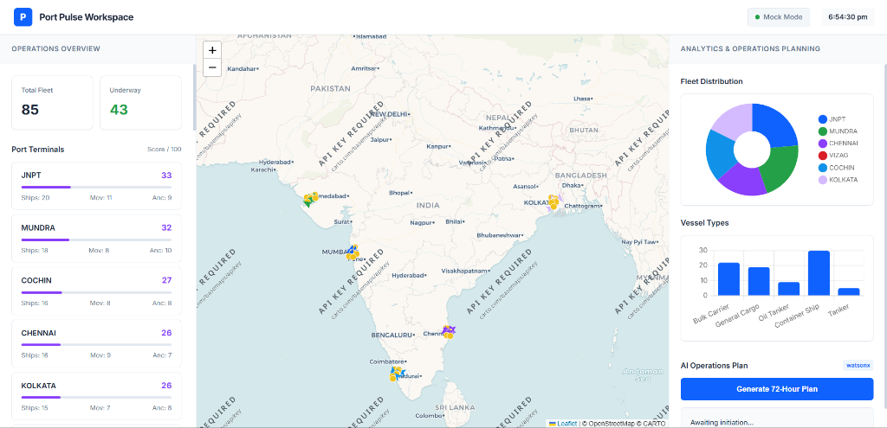
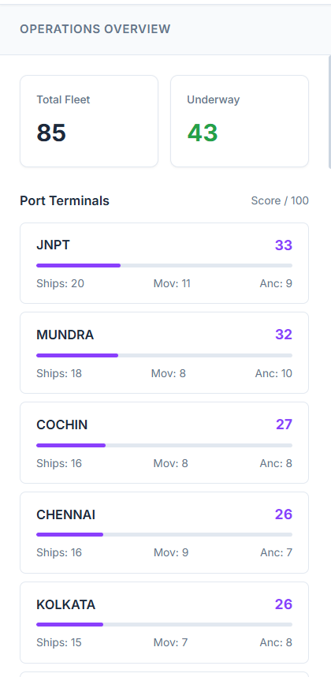
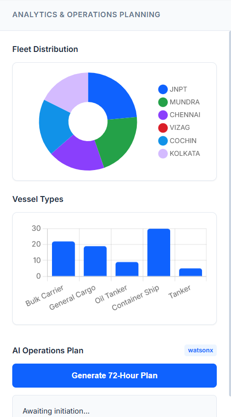
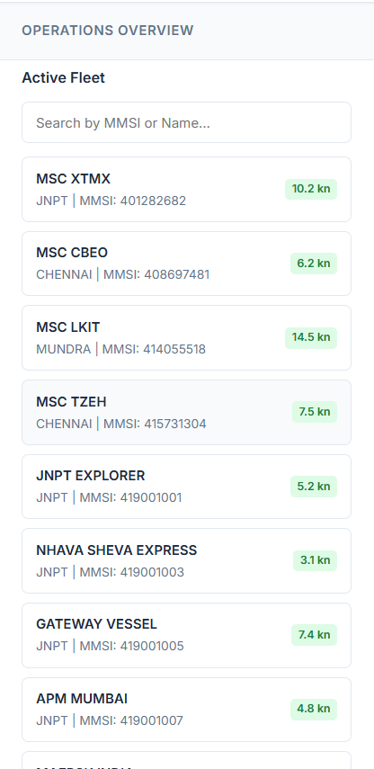
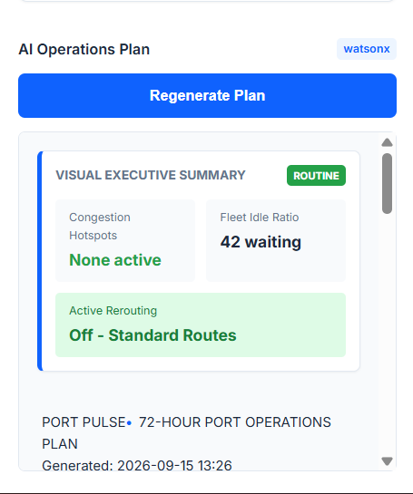

# 📸 Port Pulse — Live Demonstration Screenshots

Welcome to the Port Pulse screenshot gallery! These images demonstrate the core capabilities of the application, captured live from our highly scalable cloud deployment tracking real-world AIS satellite streams.

---

### 1. The Global Maritime Dashboard
> *Tracking 100+ global vessels in real-time via AIS satellites across the Indian coast.*

---

### 2. Live Terminal Congestion Scoring
> *Dynamic 0-100 congestion metrics calculating queue pressure and berth utilization at JNPT, Mundra, and more.*

---

### 3. Active Fleet & Speed Monitoring
> *Real-time Speed Over Ground (SOG) tracking for individual vessels actively navigating our ports.*

---

### 4. Categorized Fleet Distribution
> *Statistical breakdown categorizing incoming cargo pressure by Bulk Carriers, Oil Tankers, and Container Ships.*

---

### 5. AI-Powered Executive Routing Summary
> *IBM Watsonx Llama 3.3 actively generating supply chain predictions and triggering real-time routing diversions to alleviate congestion.*

---
*Return to [Main Project Page](../../README.md)*

