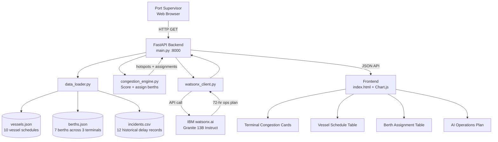

# Architecture — Port Pulse

## System Diagram



## Component Table

| Component | File | Technology | Responsibility |
|---|---|---|---|
| API Server | `src/backend/main.py` | FastAPI + Uvicorn | REST endpoints, serves frontend |
| Congestion Engine | `src/backend/congestion_engine.py` | Pure Python | 4-factor scoring + berth assignment |
| AI Client | `src/backend/watsonx_client.py` | ibm-watsonx-ai SDK | Prompt building + Granite inference |
| Data Models | `src/backend/models.py` | Pydantic v2 | Request/response validation |
| Data Loader | `src/backend/data_loader.py` | Python stdlib | JSON/CSV reading |
| Vessel Schedules | `src/data/vessels.json` | JSON | 10 incoming vessels with ETAs |
| Berth Capacity | `src/data/berths.json` | JSON | 7 berths across 3 terminals |
| Incident Log | `src/data/incidents.csv` | CSV | 12 historical delay records |
| Dashboard | `src/frontend/index.html` | HTML + Chart.js | Single-page port operations UI |

## Data Flow (end-to-end)

```
GET /api/congestion:
1. Load vessels.json + berths.json + incidents.csv
2. For each terminal: compute berth utilization, queue size, history score, priority score
3. Sum into 0-100 congestion score, assign level (LOW/MEDIUM/HIGH/CRITICAL)
4. Sort by score descending, return JSON

GET /api/assignments:
1. Load vessels.json + berths.json
2. Sort vessels: HIGH priority first, then by TEU descending
3. For each vessel: find best available berth (length + TEU + depth constraints)
4. If no berth in target terminal: try alternate terminals
5. Calculate unload time = (TEU * 2.1 crane moves) / (cranes * moves/hr)
6. Return assignment list with start/end times

GET /api/plan:
1. Run congestion scoring + berth assignment
2. Build structured prompt with top at-risk terminals
3. Call watsonx.ai Granite model (or mock fallback)
4. Return full OperationsPlan JSON with plan_text
```

## Security Notes
- API keys in `.env` (`.gitignore`) — never committed
- `.env.example` has dummy placeholder values only
- CORS open for hackathon demo — restrict in production

## Scalability Path
- Replace JSON with PostgreSQL + live AIS vessel tracking feed
- Add WebSocket for real-time vessel position updates
- Integrate actual weather API for storm impact on port operations
- Use constraint programming (OR-Tools) for optimal berth assignment at scale
- Deploy on IBM Code Engine for production
